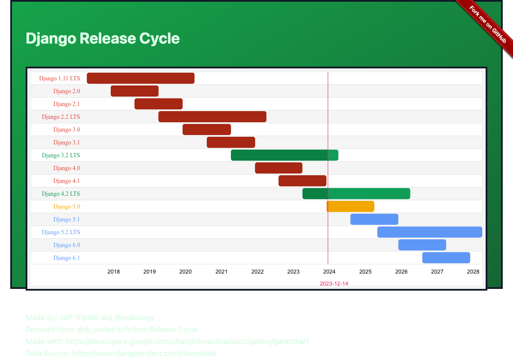

<h1 align="center">Welcome to Django Release Cycle 👋</h1>

  

> [Django Release Cycle](https://jefftriplett.com/django-release-cycle/) is based on [Dustin Ingram](https://github.com/di)'s [Python Release Cycle](https://python-release-cycle.glitch.me/).

### 🏠 [Homepage](https://jefftriplett.com/django-release-cycle/)

<!-- [[[cog
import cog
import requests
response = requests.get("https://raw.githubusercontent.com/jefftriplett/actions/main/footer.txt")
response.raise_for_status()
print(response.text.strip())
]]] -->
## Author

👤 **Jeff Triplett**

* Website: https://jefftriplett.com
* Mastodon: [@webology](https://mastodon.social/@webology)
* Twitter: [@webology](https://twitter.com/webology)
* GitHub: [@jefftriplett](https://github.com/jefftriplett)

## Show your support

Give a ⭐️ if this project helped you!
<!-- [[[end]]] -->
